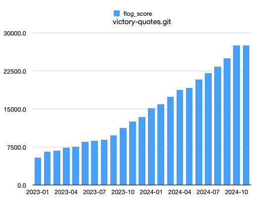

= Wresting with Complexity
:revealjs_theme: moon
:revealjs_slideNumber: true
:revealjs_transition: slide
:revealjsdir: https://cdn.jsdelivr.net/npm/reveal.js@4
:source-highlighter: highlightjs
:highlightjs-theme: https://cdnjs.cloudflare.com/ajax/libs/highlight.js/11.7.0/styles/atom-one-dark.min.css
:highlightjsdir: https://cdnjs.cloudflare.com/ajax/libs/highlight.js/11.7.0

++++

++++

== What is Complexity? 

[quote, https://www.etymonline.com/word/complex]
**complex** (_adj_), 1650s: "composed of interconnected parts, formed by a combination of simple things or elements"
from _com_ - with, _together_ + _plectere_ "to wear, braid, twine, entwine".

== Why do we have it? 
=== It's an essential property
[quote, Fred Brooks, No Silver Bullet]
The complexity of software is an essential property, not an accidental one. Hence, descriptions of a software entity that abstract away its complexity often abstract away its essence.

=== The problem domain is complex
[quote, Martin Fowler, Forward to Domain-Driven Design by Eric Evans]
There are many things that make software development complex. But the heart of this complexity is the essential intricacy of the problem domain itself.

== We have it
=== Victory

=== Red Whale
image::red-whale.png[]

== Complexity comes from two places
[cols="1,1", frame="none", grid="none", options="noheader"]
|===
| **Domain Complexity**

| **Technical Complexity**
|===

== Example: Uber
=== Domain Complexity
* Demand-based pricing
* Driver assignment
* Route optimization

=== Technical Complexity
* Real-time data processing
* Distributed systems
* Payment processing
* Mobile app development

== Example: Football Simulation Game
=== Domain Complexity
* Player attributes
* Team tactics
* Match simulation
* League simulation
* Transfer market

=== Technical Complexity
* Multiplayer
* in-game purchases
* attribute updates
* Cross-device compatibility
* Real-time updates
* Graphics

== Example: Orange
=== Domain Complexity
[source,ruby]
----
new_changes = set_rescheduled(appointment, changes) if changes.key?(:appointment_at) && over_fifteen_minutes_old?
----

[source,ruby]
----
  def dependently_collected_qc_project?
    qc? && !collect_funds_independently?
  end

  def collect_funds_independently? # rubocop:todo Metrics/CyclomaticComplexity
    payment_type == PAYMENT_TYPE_CASH ||
      (parent_project.blank? && qc_project.blank?) ||
      (og? && ((qc_project.payment_type == PAYMENT_TYPE_CASH) || qc_project.cancelled?)) ||
      (qc? && parent_project.payment_type == PAYMENT_TYPE_CASH)
  end
----

image:victory_diagrams.png[]

=== Technical Complexity
* Broadcasts
* Notifications
* Integrations (Active Prospect, Optimoroute, Quickbooks, Workday, Twilio)
* off-loading background report generation
* SQL optimization

== These complexities are unavoidable

== The Hidden Complexity
Combining the growing complexity of the domain and the complexity of the technical solution.

== My Mission
To try to tame the beasts of complexity by keeping the domain and technical complexities separate. Relatedly, I've been haunted by this tweet, for forty days and forty nights.

image:tweet.png[]

== Introducing: Dragon Drip
_Dragon Drip_ is a small-batch coffee roaster that sources raw coffee beans and sells roasted blends online.

I identified 12 _flows_ to get a first 'end-to-end slice' through the business.

=== Add Bean
Adds a new bean to the inventory

=== Add Purchase Order
Adds a new purchase order to the system

=== Receive Purchase Order
* Mark purchase order as received
* Update inventory with the received beans

=== Add Roast Type
Adds a new roast type to the system (e.g. French roast)

===  Add Product
* Adds a new product to the system for sale on the shop
* is associated with a mix of beans, and a roast type
* Has a price
* Availibility is determined directly by stock level in the inventory.

=== Add to Basket
* Adds a product to the basket in the shop
* Max basket weight can be 10kg
* Orders over $50 are free shipping

=== Place order
* Represents a customer placing an order
* Order is set to be prepared (roasting is more or less on demand)

=== Processing orders
* Not really a user flow, but would be if we didn't do it in our domain
* We demand the amount of roasted beans required for all orders in the batch that need to be shipped today 
* For each order this could be a combination of roasts types and amounts of a certain bean across many order items
* Across all order items in the batch, we generate a series of demands
* Beans are roasted in multiples of 1kg, but sold in quantities of 250g, so there's a mix of roasted and unroasted coffee around, with different use-by dates

=== Roast Beans
* Beans can only be roasted in minimum 1kg batches
* Starts the use by date countdown
* Roasts are now ready to be allocated to orders

=== Packing order items
* Preparing the coffee blends and putting them in bags

=== Ship
* Orders are packed themselves when the each order item has been packed, and then shipped.

== 1. Domain Driven Design
My first attempt was Domain-driven design (DDD). In Domain-driven design the domain is the heart of the software, and everything else revolves around it.

=== Domain model
In DDD a series of types of object are defined that represent the real world domain. High attention is paid to a 'ubiquitous language' between the domain experts (client) and the developers. e.g. if they call it an 'SDR', we call it an 'SDR' in the code. 

=== Layered architecture

DDD operates with a layered architecture (which gives me the separation of the complexities). Each layer can only call the layer below it, and doesn't know what's above it. 

image:layered-architecture.png[]

